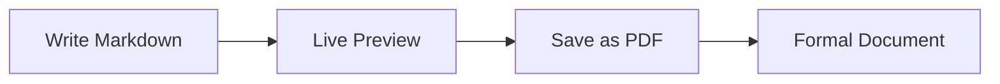

# Sample Document

<!-- Tip: place \newpage (or \pagebreak / \clearpage) on its own line to force
     a page break; \tableofcontents renders the Índice (generated from headings). -->

\tableofcontents

## Introduction

This is a **sample** Markdown document to demonstrate the DocMaster desktop editor. Everything is rendered locally — no server, no internet connection required.

### Features

- Real-time preview with professional formatting
- PDF export via the **Save as PDF** button (native print dialog)
- Bundled **Mermaid** diagram rendering
- Open / Save native file dialogs, drag & drop, and draft auto-restore

> "The preview matches the final PDF output."

## Table Example

| Feature | Status |
|---------|--------|
| Live Preview | Yes |
| PDF Export | Yes |
| Mermaid Diagrams | Yes |
| Works Offline | Yes |

## Process Diagram



\newpage

## Formal Document Style

1. The first heading becomes the document header.
2. Paragraphs are left-aligned (ATS-safe) with a serif typeface.
3. Tables, lists, and code blocks follow the professional stylesheet.
4. The PDF uses A4 pages with `2.5cm / 2.8cm` margins.

```python
print("Ready to format your documents!")
```

Enjoy writing!
